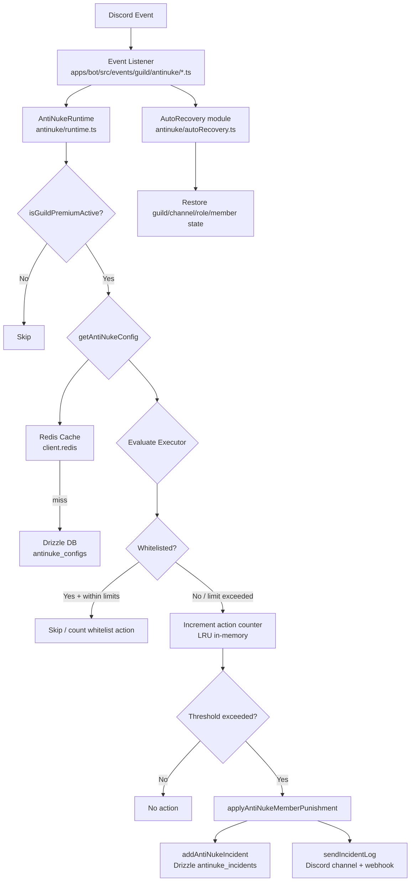
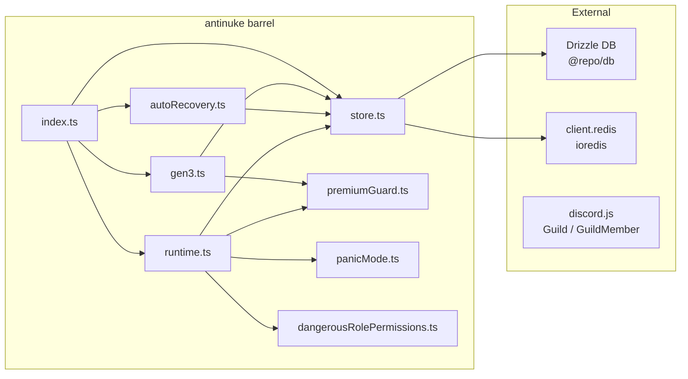

# Design Document: AntiNuke Integration

## Overview

This document describes the technical design for porting the standalone antinuke v2 engine (`antinuke/antinuke/`) into the Soward bot (`apps/bot`). The integration replaces the simple `AntiNukeService` with a full production-grade protection engine that uses Drizzle ORM, Soward's ioredis instance, and the existing `BaseClient` / `Event` / `Command` abstractions.

The antinuke v2 system guards Discord guilds against nuking attacks — mass bans, mass channel deletes, role hijacking, webhook spam, and more — by monitoring Discord audit logs in real time, maintaining per-guild action counters in LRU memory caches, enforcing configurable thresholds, applying punishments, optionally auto-reverting damage, and sending rich incident logs to a configured channel or webhook.

Key integration decisions:

- **No Prisma**: All DB access uses Drizzle ORM (`@repo/db`'s `db` instance) and the new `antinuke_configs`, `antinuke_incidents`, `antinuke_audits` tables.
- **No standalone Redis**: All cache operations use `client.redis` (the bot's existing ioredis instance).
- **No `Bot` class**: All references to the standalone framework's `Bot` are replaced with Soward's `BaseClient`.
- **No separate event framework**: All 37 listeners are ported to Soward's abstract `Event` class pattern.
- **Premium-gated**: The runtime always calls `isGuildPremiumActive` before processing any action.

---

## Architecture





---

## Components and Interfaces

### 1. `packages/db/src/schema.ts` — New Tables

Three new Drizzle tables are appended. The existing `anti_nuke` table is left untouched.

```typescript
// antinuke_configs — per-guild v2 config
export const antinukeConfigs = pgTable("antinuke_configs", {
  guildId:                text("guild_id").primaryKey()
                            .references(() => guilds.guildId, { onDelete: "cascade" }),
  enabled:                boolean("enabled").default(false).notNull(),
  enabledActions:         text("enabled_actions").array().notNull().default([]),
  moduleStates:           jsonb("module_states").notNull().default({}),
  extraOwnerIds:          text("extra_owner_ids").array().notNull().default([]),
  requiredRoleIds:        text("required_role_ids").array().notNull().default([]),
  punishment:             text("punishment").notNull().default("ban"),
  logChannelId:           text("log_channel_id"),
  whitelistUserIds:       text("whitelist_user_ids").array().notNull().default([]),
  whitelistAccess:        jsonb("whitelist_access").notNull().default({}),
  whitelistRoleIds:       text("whitelist_role_ids").array().notNull().default([]),
  whitelistRoleAccess:    jsonb("whitelist_role_access").notNull().default({}),
  thresholds:             jsonb("thresholds").notNull().default({}),
  notifyOwner:            boolean("notify_owner").default(false).notNull(),
  lockdownSnapshot:       jsonb("lockdown_snapshot").notNull().default({}),
  lockdownActive:         boolean("lockdown_active").default(false).notNull(),
  timeoutDuration:        bigint("timeout_duration", { mode: "number" }).default(3_600_000),
  thresholdWindow:        integer("threshold_window").default(10),
  whitelistExpiry:        jsonb("whitelist_expiry").notNull().default({}),
  modulePunishments:      jsonb("module_punishments").notNull().default({}),
  offenceHistory:         jsonb("offence_history").notNull().default({}),
  webhookUrl:             text("webhook_url"),
  whitelistLimitsEnabled:    boolean("whitelist_limits_enabled").default(false),
  whitelistLimitsThreshold:  integer("whitelist_limits_threshold").default(5),
  whitelistLimitsWindow:     integer("whitelist_limits_window").default(60),
  whitelistLimitsPunishment: text("whitelist_limits_punishment").default("ban"),
  whitelistLimitsActions:    text("whitelist_limits_actions").array().notNull().default([]),
  whitelistLimitsBypassRoles:text("whitelist_limits_bypass_roles").array().notNull().default([]),
  createdAt:              timestamp("created_at", { withTimezone: true }).defaultNow().notNull(),
  updatedAt:              timestamp("updated_at", { withTimezone: true }).defaultNow().notNull()
                            .$onUpdate(() => new Date()),
});

// antinuke_incidents — per-guild enforcement log (capped at 200)
export const antinukeIncidents = pgTable("antinuke_incidents", {
  id:           text("id").primaryKey(),
  guildId:      text("guild_id").notNull()
                  .references(() => guilds.guildId, { onDelete: "cascade" }),
  executorId:   text("executor_id").notNull(),
  action:       text("action").notNull(),
  punishment:   text("punishment").notNull(),
  contextLabel: text("context_label").notNull(),
  threshold:    integer("threshold").notNull().default(1),
  targetId:     text("target_id"),
  recovered:    boolean("recovered").default(false),
  details:      text("details"),
  createdAt:    timestamp("created_at", { withTimezone: true }).defaultNow().notNull(),
});

// antinuke_audits — admin action trail
export const antinukeAudits = pgTable("antinuke_audits", {
  id:        text("id").primaryKey(),
  guildId:   text("guild_id").notNull()
               .references(() => guilds.guildId, { onDelete: "cascade" }),
  actorId:   text("actor_id").notNull(),
  command:   text("command").notNull(),
  details:   jsonb("details").notNull().default({}),
  createdAt: timestamp("created_at", { withTimezone: true }).defaultNow().notNull(),
});
```

### 2. `apps/bot/src/antinuke/store.ts`

Drizzle-based rewrite of `antinukeStore.ts`. All functions accept a `redis: Redis` parameter (Soward's `client.redis`).

Key functions:
- `getAntiNukeConfig(guildId, redis)` → `AntiNukeConfig | null`
- `upsertAntiNukeConfig(config, redis)` → `AntiNukeConfig`
- `updateAntiNukeConfig(guildId, changes, redis)` → `AntiNukeConfig | null`
- `addAntiNukeIncident(incident, redis)` → `AntiNukeIncident | null`
- `addAntiNukeAudit(guildId, actorId, command, details, redis)` → `void`
- `listAntiNukeIncidents(guildId, limit, redis)` → `AntiNukeIncident[]`
- `clearAntiNukeIncidents(guildId, redis)` → `number`
- `countAntiNukeIncidentsSince(guildId, sinceMs, redis)` → `number`
- `markIncidentRecovered(id, redis)` → `void`
- `listAllAntiNukeConfigs(redis)` → `AntiNukeConfig[]`

Internal helpers `sanitizeConfig`, `sanitizeIncident`, `safeJsonParse`, and `mapDbConfig` are ported directly from the source. The `db` import is `import { db } from "@repo/db"`.

### 3. `apps/bot/src/antinuke/premiumGuard.ts`

```typescript
import { db } from "@repo/db";
import { guild_premium } from "@repo/db/schema";
import { eq } from "drizzle-orm";

export async function isGuildPremiumActive(guildId: string): Promise<boolean> {
  const row = await db.query.guild_premium.findFirst({ where: eq(guild_premium.guildId, guildId) });
  if (!row || !row.isPremium) return false;
  if (row.premiumUntil && row.premiumUntil < new Date()) return false;
  return true;
}

export async function getPremiumGuildIds(): Promise<Set<string>> {
  const rows = await db.select({ guildId: guild_premium.guildId })
    .from(guild_premium)
    .where(/* isPremium = true AND (premiumUntil IS NULL OR premiumUntil > now) */);
  return new Set(rows.map(r => r.guildId));
}
```

### 4. `apps/bot/src/antinuke/panicMode.ts`

Implements `getPanicConfigFromAntiNuke`, `enforcePanicMode`, and `quarantineMember` using Drizzle's `panic_mode_configs` table and the `dangerousRolePermissions` helper.

### 5. `apps/bot/src/antinuke/runtime.ts`

Direct port of `antinukeRuntime.ts` with these changes:
- `Bot` → `BaseClient` (import from `../base/Client`)
- `import { db } from "../../utils/database"` → `import { db } from "@repo/db"`
- `import { redis } from "../../infra/redis/redis"` → removed; `redis` is passed in as `client.redis` through each store call
- `import logger from "../../utils/logger"` → `import { client } from "../bot"` or Soward's logger utility
- `isGuildPremiumActive` → `../antinuke/premiumGuard`
- `getPanicConfigFromAntiNuke`, `quarantineMember`, `enforcePanicMode` → `../antinuke/panicMode`
- `pauseGuildQueue` → implemented locally or as no-op initially
- `V2` / `V2_FLAGS` embed builder from the standalone bot → replaced with standard `EmbedBuilder` from discord.js

The exported surface is identical:
- `evaluateAntiNukeAction(client, guild, action, options)`
- `runAntiNukeProtection(client, guild, action, contextLabel, options)`
- `runAntiNukeProtectionDetailed(client, guild, action, contextLabel, options)`
- `applyAntiNukeMemberPunishment(guild, memberId, punishment, reason, timeoutDuration, member)`
- `sendIncidentLog(guild, logChannelId, title, description, meta)`
- `startAntiNukeCounterCleanup(registerInterval)`

### 6. `apps/bot/src/antinuke/autoRecovery.ts`

Direct copy of `antinukeAutoRecovery.ts` with:
- `import logger from "../../utils/logger"` → replaced with Soward's logger
- `import { getAntiNukeConfig } from "../client/antinukeStore"` → `./store`
- `import { sendIncidentLog } from "../client/antinukeRuntime"` → `./runtime`
- All exported functions remain identical in signature

### 7. `apps/bot/src/antinuke/gen3.ts`

Direct port of `antinukeGen3.ts` with:
- `Bot` → `BaseClient`
- `import { isGuildPremiumActive, getPremiumGuildIds } from "../../utils/premiumGuard"` → `./premiumGuard`
- Store and runtime imports redirected to `./store` and `./runtime`

### 8. `apps/bot/src/antinuke/dangerousRolePermissions.ts`

Copy-as-is from source. No changes needed.

### 9. `apps/bot/src/antinuke/index.ts`

Barrel export of all public symbols.

### 10. `apps/bot/src/events/guild/antinuke/*.ts` — 37 Event Listeners

Each listener follows this pattern (example: `banAdd.ts`):

```typescript
import BaseClient from "../../base/Client";
import Event from "../../abstract/Event";
import { Events, GuildBan } from "discord.js";
import { runAntiNukeProtectionDetailed } from "../../../antinuke/runtime";
import { isAutoRecoveryEnabled, sendRecoveryReport } from "../../../antinuke/autoRecovery";

export default class AntiNukeBanAdd extends Event {
  constructor(client: BaseClient) {
    super(client, { event: Events.GuildBanAdd });
  }

  public async execute(): Promise<void> {
    this.client.on(Events.GuildBanAdd, async (ban: GuildBan) => {
      const protection = await runAntiNukeProtectionDetailed(
        this.client, ban.guild, "banAdd", `banAdd:${ban.user.tag}`,
        { targetId: ban.user.id },
      );

      if (protection.enforced) {
        const autoRecovery = await isAutoRecoveryEnabled(ban.guild.id);
        if (autoRecovery) {
          await ban.guild.members.unban(ban.user.id,
            "[ANTINUKE] Auto-recovery | Reversing unauthorized ban").catch(() => {});
          await sendRecoveryReport(ban.guild, "Ban Reversed",
            `Auto-unbanned <@${ban.user.id}> after unauthorized ban.`);
        }
      }
    });
  }
}
```

Old event files that imported `AntiNukeService` (e.g., `apps/bot/src/events/guild/banAdd.ts`) will have their antinuke logic removed or replaced to avoid double-registration.

### 11. `apps/bot/src/commands/security/Antinuke.ts` — v2 Command

Replaces the current simple command with a full v2 interactive command. Uses `upsertAntiNukeConfig`, `updateAntiNukeConfig`, `listAntiNukeIncidents`, `addAntiNukeAudit`, `parseGen3Config`, `serializeGen3ToStates`, and `persistGen3Config` from the antinuke barrel.

Subcommands exposed via slash command options:
- `enable`
- `disable`
- `config` (interactive embed with edit buttons)
- `whitelist add/remove/list/clear`
- `modules` (toggleable module select menu for all 31 ANTINUKE_PROTECTED_ACTIONS)
- `logs` (paginated incident list)
- `gen3` (interactive Gen3 config panel)
- `extraowner add/remove/list`

### 12. `apps/bot/src/service/index.ts` — Updated Wiring

The `AntiNukeService` instantiation (`this.antinukes = new AntiNukeService(client)`) is replaced with a minimal stub or removed. Any remaining callers of `client.services.antinukes` are updated to use the new runtime directly.

### 13. `apps/bot/src/base/Client.ts` — Startup Hook

In the `start` method, after `loadEvents`:

```typescript
import { startAntiNukeCounterCleanup } from "./antinuke";

// inside start():
startAntiNukeCounterCleanup((fn, ms) => setInterval(fn, ms).unref());
```

---

## Data Models

### AntiNukeConfig (TypeScript interface, persisted in `antinuke_configs`)

```typescript
interface AntiNukeConfig {
  guildId:                    string;
  enabled:                    boolean;
  enabledActions:             AntiNukeAction[];
  moduleStates:               Record<string, unknown>;  // module key → boolean or Gen3 blob
  extraOwnerIds:              string[];
  requiredRoleIds:            string[];
  punishment:                 AntiNukePunishment;        // default: "ban"
  logChannelId:               string | null;
  whitelistUserIds:           string[];                  // max 50
  whitelistAccess:            Record<string, AntiNukeWhitelistAccessProfile>;
  whitelistRoleIds:           string[];
  whitelistRoleAccess:        Record<string, AntiNukeWhitelistAccessProfile>;
  thresholds:                 Record<AntiNukeAction, number>;
  notifyOwner:                boolean;
  lockdownSnapshot:           Record<string, string>;   // roleId → permsBigInt string
  lockdownActive:             boolean;
  timeoutDuration:            number;                   // ms, default 3_600_000
  thresholdWindow:            number;                   // seconds, default 10
  whitelistExpiry:            Record<string, string>;   // userId → ISO timestamp
  modulePunishments:          Record<string, AntiNukePunishment>;
  offenceHistory:             Record<string, AntiNukeOffenceRecord>;
  webhookUrl:                 string | null;
  whitelistLimitsEnabled:     boolean;
  whitelistLimitsThreshold:   number;
  whitelistLimitsWindow:      number;
  whitelistLimitsPunishment:  AntiNukePunishment;
  whitelistLimitsActions:     AntiNukeAction[];
  whitelistLimitsBypassRoles: string[];
  createdAt:                  string;
  updatedAt:                  string;
}
```

### AntiNukeIncident (persisted in `antinuke_incidents`)

```typescript
interface AntiNukeIncident {
  id:           string;
  guildId:      string;
  executorId:   string;
  action:       AntiNukeAction;
  punishment:   AntiNukePunishment;
  contextLabel: string;
  threshold:    number;
  targetId?:    string | null;
  recovered?:   boolean;
  details?:     string | null;
  createdAt:    string;
}
```

### Redis Key Conventions

| Key pattern | TTL | Content |
|---|---|---|
| `antinuke:config:{guildId}` | 3600s | JSON-serialised `AntiNukeConfig` |
| `antinuke:config:{guildId}` = `__NULL__` | 60s | Cache-miss sentinel (no config exists) |

All other runtime counters (action counts, punishment cooldowns, Aegis counters, multi-trigger tracker, whitelist counters) are maintained entirely in LRU memory — no Redis keys are written for these.

---

## Correctness Properties

*A property is a characteristic or behavior that should hold true across all valid executions of a system — essentially, a formal statement about what the system should do. Properties serve as the bridge between human-readable specifications and machine-verifiable correctness guarantees.*

PBT is applicable here for the pure data-transformation and logic functions in `store.ts`, `premiumGuard.ts`, `gen3.ts`, and `runtime.ts`. The property-based testing library for this project is **[fast-check](https://github.com/dubzzz/fast-check)** (TypeScript-native, no extra tooling required). Each property test runs a minimum of 100 iterations.

### Property Reflection

After reviewing all testable items from the prework:
- Properties 2.10 (punishment normalisation) and 2.11 (whitelist truncation) are both input-validation properties on `sanitizeConfig`. These can be combined into a single "sanitizeConfig output is always valid" property, but they test distinct facets so they are kept separate for clarity.
- Property 5.2 (non-premium → no enforcement) and Property 5.4 (guild owner / bot → no enforcement) are logically independent bypass conditions. Keeping separate.
- Properties 7.2 (suspicious account age) and 7.4 (accountViolatesMinAge pure function) test overlapping logic. Property 7.4 is the canonical pure test; 7.2 uses it internally and is subsumed. Combined into Property 7.

---

### Property 1: Incident auto-prune keeps count ≤ 200

*For any* number of incidents N inserted for a guild (where N > 200), the total row count for that guild in `antinuke_incidents` SHALL never exceed 200 after the prune check completes.

**Validates: Requirements 2.6**

---

### Property 2: listAntiNukeIncidents returns results in descending createdAt order

*For any* set of incidents with distinct `createdAt` timestamps inserted for a guild, `listAntiNukeIncidents` SHALL return them sorted such that `result[i].createdAt >= result[i+1].createdAt` for all valid i.

**Validates: Requirements 2.8**

---

### Property 3: sanitizeConfig normalises invalid punishments to "ban"

*For any* string that is not one of the seven valid `AntiNukePunishment` values (`"warn"`, `"ban"`, `"kick"`, `"timeout"`, `"rolestrip"`, `"staged"`, `"quarantine"`), `sanitizeConfig({ ..., punishment: invalidString })` SHALL produce a config whose `punishment` field equals `"ban"`.

**Validates: Requirements 2.10**

---

### Property 4: sanitizeConfig truncates whitelistUserIds to at most 50 entries

*For any* array of distinct user IDs with length > 50 passed as `whitelistUserIds`, `sanitizeConfig` SHALL produce a config where `config.whitelistUserIds.length <= 50`.

**Validates: Requirements 2.11**

---

### Property 5: isGuildPremiumActive returns false for expired premium

*For any* date in the past used as `premiumUntil`, `isGuildPremiumActive` SHALL return `false` even when `isPremium` is `true`.

*For any* date in the future used as `premiumUntil`, `isGuildPremiumActive` SHALL return `true` when `isPremium` is `true`.

**Validates: Requirements 3.1, 3.3**

---

### Property 6: getPremiumGuildIds returns exactly the active premium guilds

*For any* set of guild records with mixed `isPremium` flags and `premiumUntil` values, `getPremiumGuildIds` SHALL return a `Set` containing exactly the guild IDs where `isPremium = true` AND (`premiumUntil` is null OR `premiumUntil` > now).

**Validates: Requirements 3.2**

---

### Property 7: accountViolatesMinAge correctly identifies underage accounts

*For any* combination of `createdTimestamp`, `minAgeValue`, and `minAgeUnit`, `accountViolatesMinAge` SHALL return `true` if and only if `Date.now() - createdTimestamp < gen3AgeToMs(minAgeUnit, minAgeValue)`.

**Validates: Requirements 7.4**

---

### Property 8: usernameFilterMatches is consistent with strict word list

*For any* username string that contains (case-insensitively) any word in `strictWords`, `usernameFilterMatches` SHALL return `true`. Conversely, if no strict or wildcard word matches the username, global name, or nickname, the function SHALL return `false`.

**Validates: Requirements 7.6**

---

### Property 9: isGen3Bypass always returns true for guild owner

*For any* `AntiNukeConfig`, if `member.id === member.guild.ownerId`, `isGen3Bypass` SHALL return `true` regardless of the whitelist configuration.

**Validates: Requirements 7.7**

---

### Property 10: evaluateAntiNukeAction returns shouldEnforce: false for non-premium guilds

*For any* guild ID not present in the premium table (i.e., `isGuildPremiumActive` returns `false`), `evaluateAntiNukeAction` SHALL return `{ shouldEnforce: false }` regardless of the action type or executor.

**Validates: Requirements 5.2**

---

### Property 11: evaluateAntiNukeAction returns shouldEnforce: false for protected executors

*For any* action type, if the resolved executor ID equals the guild owner's ID or the bot's own user ID, `evaluateAntiNukeAction` SHALL return `{ shouldEnforce: false }`.

**Validates: Requirements 5.4**

---

### Property 12: AutoRecovery in-progress guard prevents re-entrancy

*For any* `guildId` and `entityId` for which a recovery operation has been started (guard key is present in the in-memory set), any subsequent call to the same recovery function for that entity SHALL return `false` immediately without invoking Discord API calls.

**Validates: Requirements 6.9**

---

## Error Handling

### Discord API Errors
- All Discord REST calls in the runtime, auto-recovery, and Gen3 modules are wrapped in `.catch(() => null)` or `.catch(() => false)`. Errors are logged at `warn` level; they never propagate to crash the event loop.
- `applyAntiNukeMemberPunishment` catches errors per punishment type and continues; partial failures are tolerated.
- Audit log fetches respect Discord's ~1 req/5s per-guild rate limit via `AUDIT_LOG_MIN_SPACING_MS = 4500`. On 429 responses, the retry-after value from Discord's response body extends the spacing.

### Database Errors
- All Drizzle queries in `store.ts` are wrapped in try/catch. On failure, the function returns `null` or `0` as appropriate and logs the error.
- Redis errors in cache read/write paths are swallowed silently (cache is non-authoritative; DB is source of truth).

### Configuration Errors
- `sanitizeConfig` is the single normalisation gate. Any malformed field is replaced with a safe default. Invalid punishments become `"ban"`. Array overflows are truncated. Missing JSON fields fall back to `{}`.
- `safeJsonParse` prevents crashes from corrupted DB JSON blobs.

### Gen3 Errors
- `runGen3JoinGate` and `runGen3UserProfileEnforcement` catch all errors per-guild and log at `debug` level. A single guild's error never aborts processing for other guilds.

### Startup Errors
- If `startAntiNukeCounterCleanup` is called before `client.redis` is initialised, the interval will still register and simply no-op on the first execution until Redis is ready.

---

## Testing Strategy

### Dual Testing Approach

- **Unit / property tests**: Pure functions in `store.ts`, `premiumGuard.ts`, `gen3.ts`, and the evaluation logic in `runtime.ts`. Use mocked Drizzle `db` and mocked `Redis` instances.
- **Integration tests**: Event listener wiring, command handler flows, and auto-recovery with Discord.js object mocks. Use 1-3 representative examples per scenario.

### Property-Based Testing Setup

- Library: **fast-check** (`npm install --save-dev fast-check`)
- Test runner: **vitest** (already in monorepo; use `vitest --run` for single execution)
- Location: `apps/bot/src/antinuke/__tests__/`
- Each property test is tagged with a comment:
  ```
  // Feature: antinuke-integration, Property N: <property_text>
  ```
- Minimum 100 iterations per property (fast-check default is 100).

### Unit Tests (example-based)
- `store.test.ts`: Cache hit/miss, null-sentinel, invalid action filter, CRUD round-trips with mocked Drizzle
- `premiumGuard.test.ts`: `isPremium=false` returns false, null `premiumUntil` with `isPremium=true` returns true
- `gen3.test.ts`: All pure helper functions (`gen3AgeToMs`, `accountViolatesMinAge`, `userHasAdvertisingName`, `userHasNoAvatar`, `usernameFilterMatches`, `isGen3Bypass`)
- `runtime.test.ts`: `evaluateAntiNukeAction` with mocked premium guard and store, whitelist expiry edge cases

### Integration Tests (1-3 examples each)
- `events.integration.test.ts`: Verify that each listener class correctly calls `runAntiNukeProtection` with the right action string
- `command.integration.test.ts`: Verify `enable`, `disable`, and `whitelist add/remove` command flows with mocked store functions
- `autoRecovery.integration.test.ts`: Verify that recovery functions are invoked with correct Discord objects and that guard keys are set

### What is NOT property-tested
- Drizzle migration correctness (schema smoke test only)
- Discord API behavior (event emission, audit log content) — these are integration/smoke
- `startAntiNukeCounterCleanup` interval registration — smoke test
- The 37 event listeners themselves — integration tests with mocked runtime
